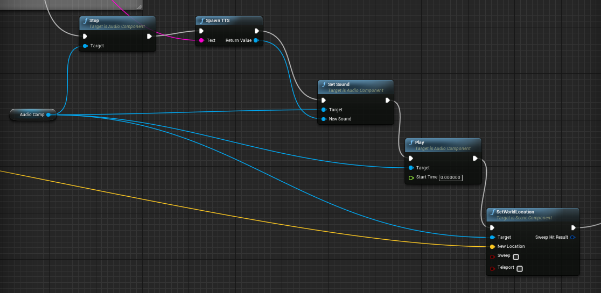

# Projects


## Index
- [Requirements](#Requirements)
- [MSLIB](#MSLIB)
- [Speech Recognition Offline](#SpeechRecognitionOffline)
- [Unreal Engine](#UnrealEngine)
- [Node.js Server](#NodeJSServer)

## <a name="Requirements"></a> Requirements

### Tools
- [Visual Studio](https://www.visualstudio.com/downloads/) (suggested 2017 version with [Node.js Tools for Visual Studio](https://www.visualstudio.com/it/vs/node-js/) installed).
- [Node.js](https://nodejs.org/it/download/)
- [Sox](https://sourceforge.net/projects/sox/)
- [Unreal Engine 4](https://www.unrealengine.com/download)

### Other Dependencies
- [MFC and ATL Libraries](https://msdn.microsoft.com/it-it/library/hh967573.aspx), downloadable from VS installer, as dependencies for MSLIB
- Microsoft Speech Runtime & Languages
	- [Microsoft Speech Platform 11 SDK](http://go.microsoft.com/fwlink/?LinkID=223570&clcid=0x409)
	- [Microsoft Speech Platform 11 Runtime](https://www.microsoft.com/en-us/download/details.aspx?id=27225)
	- [Microsoft Speech Platform 11 Runtime Languages](https://www.microsoft.com/en-us/download/details.aspx?id=27224):
		- **MSSpeech_TTS_en-US_ZiraPro**, as output voice
		- **MSSpeech_SR_en-US_TELE**, for the Speech Recognition
	You can download more languages, but you have to update accordingly MSLIB source
	
### Suggestions

After tools installation, check if **sox** and **node** work in command prompt; if not, you have to add their locations to PATH environment variable.

**Sox**
```bat
> sox --version
sox:      SoX v14.4.2
```

**Node.js**
```bat
> node -v
v6.9.1
```

## <a name="MSLIB"></a> MSLIB

### Description

MSLIB, which stands for Microsoft Speech Lib, is a simple static library which exposes the method ``TextToPCM``. This method takes a String as an input and returns a byte array containing the TTS render of said String.
MSLIB uses [Microsoft Speech API (SAPI) 5.4](https://msdn.microsoft.com/en-us/library/ee125663(v=vs.85).aspx).

**NOTE:** Make sure that the MSLIB project is pointing to your MicrosoftSpeech SDK install location (specifically, the Include and Lib folders), default for this project are ``D:\Program Files\Microsoft SDKs\Speech\v11.0\`` (x64 build) and ``D:\Program Files %28x86%29\Microsoft SDKs\Speech\v11.0`` (x86 build).

**NOTE:** If you change/update the library, recompiling, make sure to place the new version of the lib files and headers inside ``UnrealEngine_Project\RobbieTheRobot\Plugins\MicrosoftSpeechTTS\Source\MSLIB``

## <a name="SpeechRecognitionOffline"></a> Speech Recognition Offline

### Description

This is a C# project to perform offline speech to text tasks with provided keyphrases.

It is used for frequently ask actions like activation phrases (**e.g.** _Hey Robbie_) or for phrases hard to recognize (**e.g.** _Open the map_ confused with _Open them up_).


### Compile

Open **SpeechRecognition.sln** file with Visual Studio, set _Release_ and build it (Build -> Build Solution or CTRL+SHIFT+B).

You will find the executable file in _build/Release_ folder.


### Usage

```bat
SpeechRecognition <input>
```

Where \<input\> is the location of the file containing keyphrases; if not provided it will try to open _keyphrases.txt_ in the same folder of executable file.


## <a name="UnrealEngine"></a> Unreal Engine

### Description
This is a Unreal Engine project named _RobbieTheRobot_.

It contains the third person preset and a TCP C++ class exposed to Blueprint: it allows to start two TCP servers on ports 127.0.0.1:9000 and 127.0.0.1:9001 and they are used respectively to receive speech-to-text transcription and the response from chat-bot.

ThirdPersonCharacter Blueprint is used to setup the TCP server and you can find documentation in it.

### MicrosoftSpeechTTS

MicrosoftSpeechTTS is an Unreal Engine plugin which exposes a Blueprint Node called **Spawn TTS**. This node takes a **Text** as input and outputs a **SoundWave**, as simple as that.
To play the output an AudioComponent is needed. Here's how the **Spawn TTS** node is used in this project:




### Usage
You can launch the game with right click on RobbieTheRobot.uproject and click _Launch game_ or double-click to open the project.


## <a name="NodeJSServer"></a> Node.js Server

### Description
This is a Node.js project use to manage speech-to-text both offline and online (throught _Watson SpeechToText service_); to send the transcription to _Watson Conversation service_ and to send the chat-bot response to Unreal Engine game.

### Requirements
This project needs the Unreal Engine game launched to run.

### Install
Run the following command to install the project dependencies.
```bat
npm install
```

### Usage
Run the following command to execute the project.

```bat
node index.js
```

## Usage summary

1. Compile the SpeechRecognition project, then copy ``SpeechRecognition.exe`` and ``keyphrases.txt`` inside the NodeJSServer folder
2. Make sure Unreal Engine is building the project correctly
3. Start the game (from the UE Editor or launch the game binary) 
4. Start the nodejs server


### Details

#### Speech Recognition
This software use the offline speech-to-text generated from [SpeechRecognition](#SpeechRecognitionOffline) project; when it fails, the node server runs **sox** to get microphone stream from default audio input device, recognize the silence, convert it to `.ogg` format and send it to Watson.

#### Services credentials
You can change service credentials opening `index.js` (_Watson Conversation_) and `src/SpeechRecognition.js` (_Watson SpeechToText_).

#### Improve offline recognition
`keyphrases.txt` contains all phrases that have to be recognized offline: if you notice that some phrases are missing you can add them into this file.

## Author
Daniel Bertocci (original author)
Federico D'Ambrosio
Enrico Ferro
Edoardo Ferrante

### Contacts

- [GitHub](https://github.com/DanielBertocci)
- [Telegram](https://telegram.me/DanielBertocci)